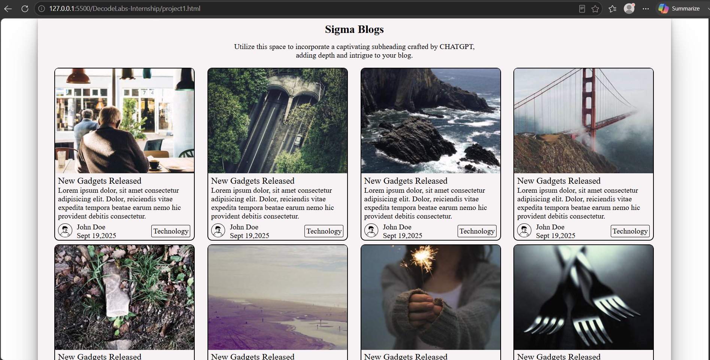

# Sigma Blogs

A responsive blog webpage built using **HTML** and **CSS**. The project showcases a clean card-based blog layout with images, author information, categories, and responsive design principles.

## Features

* Responsive grid layout using CSS Grid
* Blog cards with images and descriptions
* Author profile section
* Category tags
* Image hover effects
* Clean and modern UI
* Mobile-friendly design using `auto-fit` and `minmax()`

## Technologies Used

* HTML5
* CSS3

  * Flexbox
  * CSS Grid
  * Responsive Design
  * Hover Animations

## Project Structure

```text
├── project1.html
├── project1.css
└── README.md
```

## Key Concepts Implemented

### HTML

* Semantic page structure
* Headings
* Images
* Links
* Containers and content organization

### CSS

* CSS Grid Layout
* Flexbox Layout
* Responsive Design
* Box Shadows
* Border Radius
* Hover Effects
* Image Positioning

## Screenshots



## How to Run

1. Download or clone the repository.
2. Open the project folder.
3. Open `project1.html` in any modern web browser.

## Learning Outcomes

Through this project, I practiced:

* Building responsive layouts
* Working with CSS Grid and Flexbox
* Creating reusable card components
* Improving webpage styling and user experience
* Organizing content using HTML and CSS

## Future Improvements

* Add a navigation bar
* Add dark mode support
* Connect blog cards to actual blog pages
* Fetch blog data dynamically using JavaScript

## Author

**Shreya Goel**

GitHub: https://github.com/goelshreya3001-droid

---

Created as part of a Web Development learning project.
